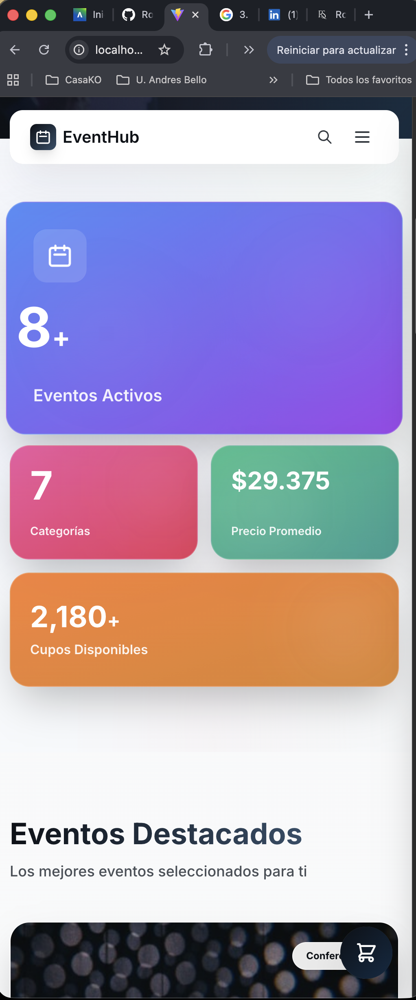
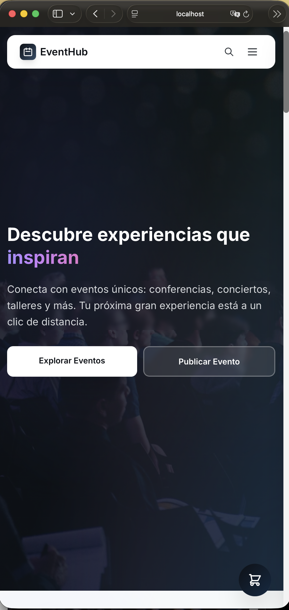
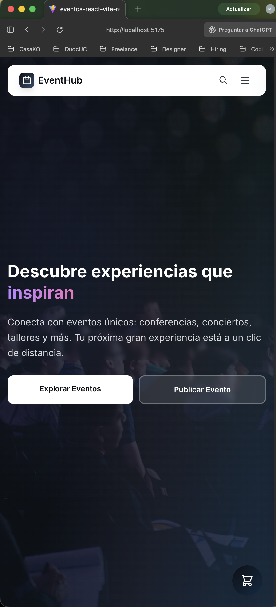

<div align="center">

# 🎫 EventHub

### Plataforma Profesional de Gestión y Descubrimiento de Eventos

[](https://react.dev/)
[](https://vitejs.dev/)
[](https://tailwindcss.com/)
[](https://reactrouter.com/)
[](LICENSE)

**EventHub** es una plataforma web de última generación diseñada para revolucionar la forma en que las personas descubren, exploran y crean eventos. Con una arquitectura moderna y una interfaz intuitiva, conecta organizadores con audiencias de manera eficiente y profesional.

[🚀 Ver Demo en Vivo](https://rodrigosanchezdev.github.io/eventos-react-vite-rest-graphql/) · [Reportar Bug](https://github.com/RodrigoSanchezDev/eventos-react-vite-rest-graphql/issues) · [Solicitar Feature](https://github.com/RodrigoSanchezDev/eventos-react-vite-rest-graphql/issues)

</div>

---

## 📑 Tabla de Contenidos

- [Características](#-características-principales)
- [Tecnologías](#-stack-tecnológico)
- [Arquitectura](#-arquitectura-del-proyecto)
- [Instalación](#-instalación-rápida)
- [Uso](#-uso)
- [API Documentation](#-documentación-de-apis)
- [Componentes](#-componentes-principales)
- [Testing](#-testing-de-compatibilidad)
- [Roadmap](#-roadmap)
- [Contribución](#-contribución)
- [Licencia](#-licencia)
- [Autor](#-autor)

---

## ✨ Características Principales

<table>
<tr>
<td width="50%">

### 🎯 Para Usuarios
- **Exploración Intuitiva**: Navegación fluida con búsqueda avanzada
- **Buscador Inteligente**: Busca por categoría en el navbar
- **Carrito de Compras**: Agrega eventos y gestiona tu compra
- **Filtros Avanzados**: Por categoría, fecha, precio y ubicación
- **Detalles Completos**: Información exhaustiva de cada evento
- **Diseño Responsivo**: Experiencia perfecta en todos los dispositivos
- **Checkout Completo**: Proceso de compra en 3 pasos

</td>
<td width="50%">

### 📝 Para Organizadores
- **Creación Simplificada**: Formulario intuitivo de publicación
- **Gestión Completa**: Panel de control de eventos
- **Estadísticas**: Métricas de rendimiento en tiempo real
- **Validación Automática**: Sistema de validación de datos
- **Publicación Instantánea**: Tu evento visible al momento

</td>
</tr>
</table>

### 🚀 Características Técnicas

- ⚡ **Alto Rendimiento**: Carga ultrarrápida con Vite
- 🔄 **Arquitectura Moderna**: React 19 con Hooks avanzados
- 🎨 **UI/UX Profesional**: Diseño glassmórfico con bento grids
- 📱 **Mobile First**: Optimizado para dispositivos móviles
- 🔌 **APIs Duales**: Integración REST y GraphQL con MSW
- 🛒 **Carrito de Compras**: Sistema completo con localStorage
- 🔍 **Búsqueda Inteligente**: Filtrado en tiempo real por categorías
- 🎭 **Componentes Reutilizables**: Arquitectura modular escalable
- 🔒 **Type Safe**: Validación de datos en tiempo real
- ♿ **Accesible**: Cumple estándares WCAG

---

## 🛠 Stack Tecnológico

### Frontend Core
```
React 19.2.0          → Framework UI de última generación
Vite 7.2.4            → Build tool de alta velocidad
React Router DOM 6.x  → Enrutamiento SPA profesional
```

### Styling & UI
```
Tailwind CSS 3.4      → Framework CSS utility-first
Google Fonts (Inter)  → Tipografía profesional
Custom Components     → Sistema de diseño propietario
```

### Backend Mock & APIs
```
MSW (Mock Service Worker) → Interceptación de peticiones HTTP
REST API              → Endpoints mock para operaciones CRUD
GraphQL API           → Queries avanzadas con datos extendidos
JSON Data Store       → Persistencia local de datos
```

### Tooling & Development
```
ESLint               → Linting y calidad de código
PostCSS              → Procesamiento CSS avanzado
NPM                  → Gestión de dependencias
Git                  → Control de versiones
```

---

## 📁 Arquitectura del Proyecto

```
eventos-react-vite-rest-graphql/
│
├── 📂 src/
│   │
│   ├── 📂 components/              # Componentes reutilizables
│   │   ├── 📂 cart/
│   │   │   └── FloatingCart.jsx   # Carrito flotante con panel deslizante
│   │   ├── 📂 events/
│   │   │   └── EventCard.jsx      # Tarjeta de evento con botón de carrito
│   │   ├── 📂 layout/
│   │   │   ├── Navbar.jsx         # Navbar con buscador inteligente
│   │   │   └── Footer.jsx         # Footer con enlaces y redes sociales
│   │   └── 📂 ui/
│   │       ├── LoadingSpinner.jsx # Componente de carga animado
│   │       ├── ErrorMessage.jsx   # Manejo de errores UX-friendly
│   │       └── EmptyState.jsx     # Estados vacíos informativos
│   │
│   ├── 📂 context/                 # Context API
│   │   └── CartContext.jsx        # Estado global del carrito
│   │
│   ├── 📂 pages/                   # Páginas de la aplicación
│   │   ├── Home.jsx               # Landing con hero y bento grid stats
│   │   ├── EventList.jsx          # Lista con búsqueda y filtros
│   │   ├── EventDetail.jsx        # Vista detallada con selector cantidad
│   │   ├── CreateEvent.jsx        # Formulario de creación
│   │   ├── About.jsx              # Información con diseño impactante
│   │   ├── Cart.jsx               # Página del carrito de compras
│   │   ├── Checkout.jsx           # Proceso de pago en 3 pasos
│   │   └── OrderSuccess.jsx       # Confirmación de compra
│   │
│   ├── 📂 services/                # Capa de servicios con MSW
│   │   ├── restApi.js             # REST API con fetch a /api/*
│   │   └── graphqlApi.js          # GraphQL API con fetch a /graphql
│   │
│   ├── 📂 mocks/                   # Mock Service Worker
│   │   ├── handlers.js            # Handlers REST y GraphQL
│   │   ├── browser.js             # Configuración MSW navegador
│   │   └── 📂 backup/             # Archivos legacy (respaldo)
│   │
│   ├── 📂 data/                    # Fuente de datos
│   │   └── events.json            # Dataset de 8+ eventos
│   │
│   ├── App.jsx                     # Componente raíz con routing
│   ├── main.jsx                    # Entry point de la aplicación
│   └── index.css                   # Estilos globales + Tailwind
│
├── 📂 public/                      # Assets estáticos
├── 📄 index.html                   # HTML template
├── 📄 package.json                 # Dependencias del proyecto
├── 📄 tailwind.config.js           # Configuración Tailwind personalizada
├── 📄 postcss.config.js            # Configuración PostCSS
├── 📄 vite.config.js               # Configuración Vite
└── 📄 README.md                    # Este archivo
```

---

## 🚀 Instalación Rápida

### Prerrequisitos

Asegúrate de tener instalado:
- **Node.js** `18.0.0` o superior
- **npm** `9.0.0` o superior

### Pasos de Instalación

```bash
# 1. Clonar el repositorio
git clone https://github.com/tu-usuario/eventhub.git

# 2. Navegar al directorio
cd eventos-react-vite-rest-graphql

# 3. Instalar dependencias
npm install

# 4. Iniciar servidor de desarrollo
npm run dev
```

La aplicación estará disponible en `http://localhost:5173`

### Scripts Disponibles

```bash
npm run dev      # Servidor de desarrollo con HMR
npm run build    # Build de producción optimizado
npm run preview  # Preview del build de producción
npm run lint     # Ejecutar ESLint
```

---

## 💻 Uso

### Navegación Principal

```javascript
/                    → Página de inicio con eventos destacados y stats
/eventos             → Lista completa con búsqueda y filtros
/eventos/:id         → Detalles completos del evento con selector cantidad
/crear-evento        → Formulario de creación de eventos
/acerca              → Información sobre la plataforma
/cart                → Carrito de compras con resumen
/checkout            → Proceso de pago en 3 pasos
/order-success       → Confirmación de compra exitosa
```

### Buscador Inteligente en Navbar

- **Panel Modal**: Búsqueda flotante con backdrop blur
- **Filtro por Categorías**: Pills interactivos para 8 categorías
- **Búsqueda en Tiempo Real**: Filtra mientras escribes
- **Vista de Resultados**: Tarjetas con imagen, info y precio
- **Navegación Directa**: Click en resultado va al detalle
- **Responsive**: Funciona perfecto en móvil y desktop

### Sistema de Carrito de Compras

- **FloatingCart**: Botón flotante con badge de cantidad
- **Panel Deslizante**: Vista rápida desde cualquier página
- **Gestión Completa**: Agregar, quitar, modificar cantidad
- **Persistencia**: Datos guardados en localStorage
- **Checkout en 3 Pasos**: Personal → Pago → Facturación
- **Confirmación**: Página de éxito con detalles del pedido

### Creación de Eventos

1. Navega a `/crear-evento`
2. Completa el formulario con los datos del evento
3. Opcionalmente añade una URL de imagen
4. Haz clic en "Publicar Evento"
5. Serás redirigido a la lista de eventos

---

## 📡 Documentación de APIs

### REST API con MSW

**MSW (Mock Service Worker)** intercepta peticiones HTTP reales a `/api/*`

Ubicación: 
- `src/services/restApi.js` - Cliente API
- `src/mocks/handlers.js` - Handlers MSW

#### Endpoints Disponibles

```javascript
// GET /api/events - Obtener todos los eventos
await fetch('/api/events')
// Retorna: { success: true, data: Array<Event> }

// GET /api/events/:id - Obtener evento por ID  
await fetch('/api/events/1')
// Retorna: { success: true, data: Event } o { success: false } (404)

// GET /api/events/category/:category - Filtrar por categoría
await fetch('/api/events/category/Conferencia')
// Retorna: { success: true, data: Array<Event> }

// GET /api/search?q=query - Buscar eventos
await fetch('/api/search?q=tech')
// Retorna: { success: true, data: Array<Event>, count: number }

// POST /api/events - Crear nuevo evento
await fetch('/api/events', { method: 'POST', body: JSON.stringify(event) })
// Retorna: { success: true, data: Event, message: string } (201)

// GET /api/stats - Estadísticas generales
await fetch('/api/stats')
// Retorna: { success: true, data: { totalEvents, categories, totalSeats, averagePrice } }
```

**Características MSW:**
- ✅ Delay de red realista (200-500ms)
- ✅ Códigos HTTP correctos (200, 201, 404, 500)
- ✅ Peticiones fetch reales interceptadas
- ✅ Solo activo en desarrollo
- ✅ Logs en consola del navegador

### GraphQL API con MSW

**MSW** intercepta peticiones GraphQL POST a `/graphql`

Ubicación:
- `src/services/graphqlApi.js` - Cliente GraphQL
- `src/mocks/handlers.js` - Handlers GraphQL

#### Queries Disponibles

```graphql
# Obtener detalles completos del evento
query GetEventDetails($id: ID!) {
  event(id: $id) {
    id, title, date, time, location, category
    description, price, availableSeats
  }
}

# Buscar eventos por organizador
query SearchByOrganizer($organizer: String!) {
  events(organizer: $organizer) {
    id, title, date, location
  }
}

# Información de asistentes
query GetAttendees($eventId: ID!) {
  attendees(eventId: $eventId) {
    total, availableSeats, eventId
  }
}

# Eventos próximos
query GetUpcomingEvents {
  upcomingEvents {
    id, title, date, time, location, category
  }
}
```

#### Uso del Cliente

```javascript
import { graphqlApi } from './services/graphqlApi';

// Usando métodos de conveniencia
const response = await graphqlApi.getEventDetails('1');
const events = await graphqlApi.searchByOrganizer('TechCorp');
const attendees = await graphqlApi.getAttendees('1');
const upcoming = await graphqlApi.getUpcomingEvents();

// Usando query personalizado
const result = await graphqlApi.query(customQuery, variables);
```

---

## 🧩 Componentes Principales

### EventCard

Componente de tarjeta para mostrar eventos con botón de agregar al carrito.

```jsx
<EventCard event={eventObject} />
```

**Props:**
- `event` (Object): Datos del evento con estructura definida

**Features:**
- Integración con CartContext
- Botón "Agregar al Carrito" con icono
- Hover effects suaves
- Link automático a detalles
- Prevención de navegación en botón carrito

### Navbar

Barra de navegación con buscador inteligente integrado.

**Features:**
- **Buscador Inteligente**: Panel modal con búsqueda y filtros por categoría
- Pills de categorías interactivos
- Resultados en tiempo real con imágenes
- Menú hamburguesa para móvil
- Botón de búsqueda en desktop y móvil
- Navegación fluida con React Router
- Logo interactivo

### FloatingCart

Carrito flotante con panel deslizante.

**Features:**
- Botón flotante (bottom-right) con badge de cantidad
- Panel deslizante de 420px con backdrop blur
- Lista de items con controles +/-
- Resumen de precios con cargo por servicio
- Botones de acción: Ver Carrito / Checkout
- Overlay con click para cerrar
- Integración completa con CartContext

### CartContext

Context API para gestión global del carrito.

**Funciones disponibles:**
```javascript
const {
  cartItems,           // Array de items
  addToCart,           // Agregar evento
  removeFromCart,      // Eliminar evento
  updateQuantity,      // Cambiar cantidad
  clearCart,           // Vaciar carrito
  getCartTotal,        // Total en pesos
  getCartCount,        // Cantidad items
  isCartOpen,          // Estado del panel
  toggleCart,          // Abrir/cerrar
  setIsCartOpen        // Setter directo
} = useCart();
```

**Persistencia:**
- Guarda automáticamente en `localStorage`
- Clave: `eventhub-cart`
- Se carga al iniciar la app

### LoadingSpinner

Indicador de carga animado y personalizable.

```jsx
<LoadingSpinner size="md" text="Cargando eventos..." />
```

**Props:**
- `size` (String): 'sm' | 'md' | 'lg'
- `text` (String): Texto informativo opcional

---

## 🧪 Testing de Compatibilidad

EventHub ha sido exhaustivamente probado en múltiples navegadores para garantizar una experiencia consistente en todos los dispositivos.

<table>
<tr>
<th>Navegador</th>
<th>Desktop</th>
<th>Mobile</th>
</tr>

<tr>
<td>

</td>
<td>

</td>
<td>

</td>
</tr>

<tr>
<td>

</td>
<td>

</td>
<td>

</td>
</tr>

<tr>
<td>

</td>
<td>

</td>
<td>

</td>
</tr>

</table>

### ✅ Navegadores Soportados

- **Chrome** 90+ (Desktop & Mobile)
- **Safari** 14+ (Desktop & Mobile)
- **Atlas** (ChatGPT Browser)
- **Firefox** 88+ (Desktop & Mobile)
- **Edge** 90+ (Desktop & Mobile)

---

## 🗺 Roadmap

### Versión 2.0 (Q1 2026)
- [ ] Sistema de autenticación de usuarios
- [ ] Panel de administración para organizadores
- [ ] Sistema de reservas y pagos
- [ ] Notificaciones push en tiempo real
- [ ] Integración con calendarios (Google, Outlook)

### Versión 2.5 (Q2 2026)
- [ ] App móvil nativa (React Native)
- [ ] Sistema de reseñas y ratings
- [ ] Chat en vivo con organizadores
- [ ] Recomendaciones personalizadas con IA
- [ ] Modo oscuro completo

### Versión 3.0 (Q3 2026)
- [ ] Backend real con Node.js/Express
- [ ] Base de datos PostgreSQL/MongoDB
- [ ] CDN para imágenes
- [ ] Analytics dashboard completo
- [ ] API pública documentada

---

## 🤝 Contribución

Las contribuciones son bienvenidas y apreciadas. Para contribuir:

1. **Fork** el proyecto
2. Crea una rama para tu feature (`git checkout -b feature/AmazingFeature`)
3. Commit tus cambios (`git commit -m 'Add: Amazing new feature'`)
4. Push a la rama (`git push origin feature/AmazingFeature`)
5. Abre un **Pull Request**

### Guías de Contribución

- Sigue la guía de estilo existente
- Escribe commits descriptivos
- Añade tests si es aplicable
- Actualiza la documentación
- Respeta el código de conducta

---

## 📄 Licencia

Este proyecto está licenciado bajo la **Licencia MIT**. Consulta el archivo [LICENSE](LICENSE) para más detalles.

```
MIT License - Copyright (c) 2025 Rodrigo Sanchez
```

---

## 👨‍💻 Autor

<div align="center">

### **Rodrigo Sanchez**

*Full Stack Developer & UX/UI Designer*

Especializado en crear experiencias web excepcionales con tecnologías modernas y diseño centrado en el usuario.

[](https://www.linkedin.com/in/sanchezdev/)
[](https://github.com/RodrigoSanchezDev/)
[](https://sanchezdev.com/)
[](mailto:rodrigo@sanchezdev.com)

</div>

---

<div align="center">

### ⭐ Si este proyecto te resultó útil, considera darle una estrella

**Construido con** ❤️ **usando React, Vite y Tailwind CSS**

*EventHub - Conectando personas con experiencias inolvidables*

</div>
